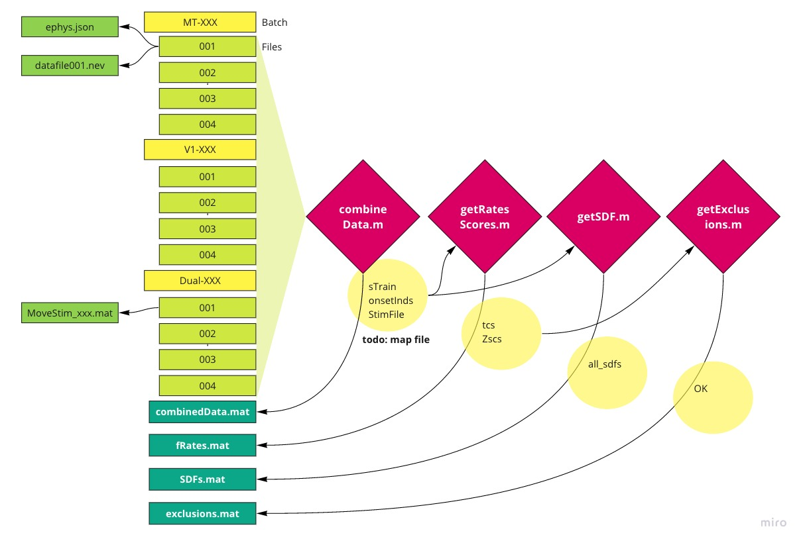

# processSpikingMoveStim
Functions that create intermediate analysis files. This is meant to work on a file hierarchy compatible with marmolab-pipeline. 

It integrates: 
- kilosort cluster outputs and spike times
- digital event timing from NEV for stimulus synch
- information from Stim files (.mat)

# Instructions for use
There are slurm files to run the batching on the cluster, used in the following order:  

### 1. Extract the spikes from any intan recordings
`runSpikeExtractNeurostim.sbatch` extracts spikes for each channel in an marmodata file and saves them in spike train format by calling `RUNAnalysis_mdbExtract.m`. The congfiguration for which files this processes is provided in `configureBatch_mdb.m`. This isn't necessary for the data recorded on Blackrock systems. 

### 2. Do some basic spike processing
`runProcessSpiking.sbatch` calls `RUNAnalysis_brain.m` to merge files and channels into aggregate spike trains, tuning curves, sdfs, and exclusion files. It produces the following intermediate data files that are useful for further analysis. 

# Testing
Use `tests/configureRunTests.m` to generate good summaries of the exports so that we can assess the quality of the data/detect bugs or encoding problems in the data files. 

# Summary of outputs
## combinedData.mat
`chanOrder` (1x2 cell, where each cell is an array/area)
- has a list of all the channels, for the NN arrays in depth order, for Utah arrays, just 1-96 (see #1 ). However, this is kind of pointless for data post-KS. With KS this data is in `clustInfo{i}.clusterInfo`

`clustInfo` (1x2 cell, where each cell is an array/area)
- has the kilosort related information for each unit identified in each area.
- 
`onsetInds` (1x4 cell, where each cell is a 1x2 recording file x array)
This has the stimulus identity and timing.

`param` (structure)
This has information about the trial types and time course, and which integration windows should be used for 1) spike counts or 2) SDFs. 

`StimFile` (1x4 cell, with each cell a recording file)
This has the information used to create the stimulus, bundled from the separate stimulus file saved during the experiment.

`sTrain` (1x4 cell, with each cell a recording file, where each cell is a 1x2 array index)
This has spike trains for each neuron or electrode during the recording. Millisecond resolution, 1/0 encoding.

## fRates.mat
`chanOrder` (1x2 cell, where each cell is an array/area), `param` (structure)
As above. Re-encoded here, because this file is more lightweight.

`tcs` (structure)
`tcs.[Move | Blank].[Dots | SineWave | Square | PSsquare]{array, direction}`(2x12 cell array). Each cell has a nUnitsxnTrials spike count, integrated during the window indicated in `param`. 

`Zscs` (structure)
Mirror of `tcs`, but has z-scored rates not raw rates. Z-scoring is done *within* a stimulus type so stimulus selectivity is destroyed.

`tcs_byFile` (structure)
`tcs.[Move | Blank].[Dots | SineWave | Square | PSsquare]{1x4}{array, direction}`
Tuning curves, but without the trials combined over different recording files.

## exclusions.mat
`isVisual` (1x2 cell, where each cell is an array/area)
Has 4xnUnits array where visual responsiveness was tested separately for each stimulus type. 1 = has significant visual response.

`anyVisual` (1x2 cell, where each cell is an array/area)
As above, but 1= has significant visual response for any of the stimulus types. 

`DSI` (1x2 cell, where each cell is an array/area)
Direction selectivity for any unit with a significant visual response. Difference/sum of the peak and anti-peak direction.

## SDFs.mat

`param` (as elsewhere)

`all_sdfs` 
`all_sdfs.[Dots | SineWave | Square | PSsquare]{array, direction}`
Each cell is a nChannelsxnTrialsxnTimepoints 3D matrix.
